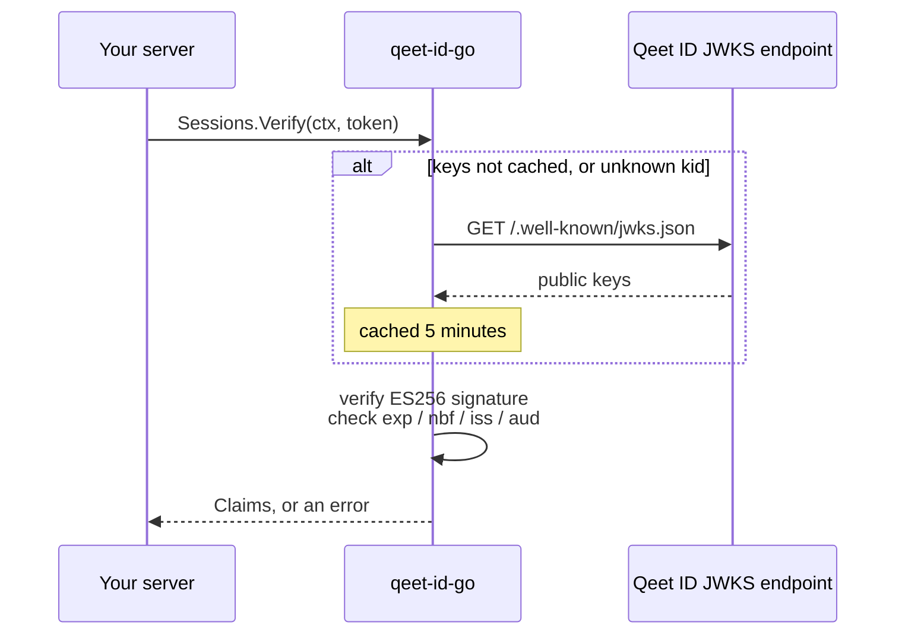
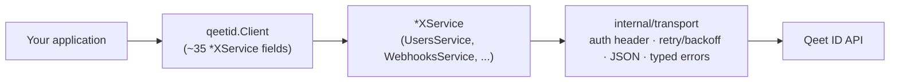

# qeet-id-go

[](go.mod)
[](LICENSE)

The official server-side Go SDK for [Qeet ID](https://qeet.in) — the passkeys-first identity platform. One client, ~90 typed methods across users, organizations, roles, federation (OIDC/SAML/SCIM/LDAP), fine-grained authorization (RBAC/ReBAC/AuthZEN), AI-agent identities, compliance, and billing — with local JWT verification, automatic retries, auto-pagination, and webhook signature verification built in, on zero third-party dependencies.

```go
client := qeetid.New(qeetid.Config{APIKey: os.Getenv("QEETID_API_KEY")})

user, err := client.Users.Create(ctx, qeetid.CreateUserInput{Email: "ada@example.com"})
claims, err := client.Sessions.Verify(ctx, token)
allowed, err := client.Permissions.Check(ctx, qeetid.PermissionCheck{
	User: claims.UserID, Tenant: claims.TenantID, Permission: "billing:write",
})
```

New to Qeet ID, or to CIAM SDKs in general? Read [Concepts](#concepts) first — it explains every acronym below in plain English before you touch any code.

---

## Table of contents

- [Concepts](#concepts) — start here if any of the jargon above is unfamiliar
- [Requirements](#requirements)
- [Installation](#installation)
- [Quick start](#quick-start)
- [Without vs. with this SDK](#without-vs-with-this-sdk)
- [Configuration](#configuration)
- [Resource reference](#resource-reference)
- [Core concepts, in code](#core-concepts-in-code)
  - [Session verification (local JWKS)](#session-verification-local-jwks)
  - [Choosing an authorization model](#choosing-an-authorization-model)
  - [Pagination](#pagination)
  - [Webhooks](#webhooks)
  - [Zero-config discovery](#zero-config-discovery)
  - [Error handling](#error-handling)
  - [Observability](#observability)
- [Architecture](#architecture)
- [Testing your integration](#testing-your-integration)
- [Examples](#examples)
- [Documentation](#documentation)
- [FAQ](#faq)
- [Versioning and compatibility](#versioning-and-compatibility)
- [Contributing](#contributing)
- [Security](#security)
- [Support](#support)
- [License](#license)

## Concepts

A quick glossary before the code, for anyone new to identity platforms — skip ahead if these are all familiar.

| Term | What it means here |
|---|---|
| **Tenant / Organization** | A customer account on Qeet ID. Every user, role, and resource belongs to exactly one. This SDK calls it `Organization`; the wire format still says `tenant_id` — same thing, two names. |
| **API key** (`qk_…`) | A long-lived secret your *backend* uses to call the management API (create users, assign roles, ...). Never sent to a browser. |
| **Session token** | A short-lived token issued to an *end user* after they log in. Your backend receives it on incoming requests and verifies it — that's what `Sessions.Verify` does. |
| **JWT / ES256** | Session tokens are [JSON Web Tokens](https://jwt.io) signed with ES256 (an elliptic-curve algorithm). Signing means the token can't be forged; it doesn't mean it's secret — anyone can read the claims inside, only Qeet ID can produce a validly-signed one. |
| **JWKS** | JSON Web Key Set — the *public* keys Qeet ID uses to sign tokens, published at a well-known URL. Verifying a token means checking its signature against a key in this set — no call back to Qeet ID needed once the keys are cached. |
| **RBAC** | Role-Based Access Control — "does this user have the `admin` role, which grants `billing:write`?" The model most apps start with. |
| **ReBAC** | Relationship-Based Access Control (Zanzibar/Google-Docs-style) — "can this user view this document *because* they're in the `eng` group, which was granted `viewer`?" Answers questions RBAC can't: per-resource sharing, nested group inheritance. |
| **AuthZEN** | An open standard (OpenID) for a single authorization-check request/response shape that can be answered by *either* RBAC or ReBAC underneath — useful if you want one call site that doesn't need to know which model decided. |
| **Webhook** | Qeet ID calling *your* server when something happens (`user.created`, ...). You must verify the signature before trusting the payload — see [Webhooks](#webhooks). |

## Requirements

- **Go 1.23+** (the SDK uses `iter.Seq2` range-over-func iterators for pagination).
- A Qeet ID account and a server-side API key (`qk_…`) — see [qeet.in](https://qeet.in) to create one.

## Installation

```bash
go get github.com/qeetgroup/qeet-id-go
```

```go
import "github.com/qeetgroup/qeet-id-go"
```

## Quick start

```go
package main

import (
	"context"
	"fmt"
	"log"
	"os"

	"github.com/qeetgroup/qeet-id-go"
)

func main() {
	// 1. Build one client, backed by your secret API key. Reuse it for the lifetime of your process — it's safe for concurrent use.
	client := qeetid.New(qeetid.Config{
		APIKey: os.Getenv("QEETID_API_KEY"), // a server-side qk_… key
	})

	// 2. Every method takes a context and returns (result, error) — no exceptions, no hidden panics on a 404 or a bad request.
	ctx := context.Background()
	user, err := client.Users.Create(ctx, qeetid.CreateUserInput{
		Email:       "ada@example.com",
		DisplayName: "Ada Lovelace",
	})
	if err != nil {
		log.Fatal(err)
	}
	fmt.Println("created", user.ID)
}
```

> [!WARNING]
> **Never** embed an API key in client-side code (browser, mobile). This SDK is for servers, workers, and CLIs only — it authenticates with a secret key that must never leave your backend.

## Without vs. with this SDK

The most common real-world task — verifying a session token on every incoming request — makes the difference concrete. Both snippets do the same thing; only one of them is safe to ship.

<table>
<tr><th>Without this SDK</th><th>With this SDK</th></tr>
<tr valign="top">
<td>

```go
// You'd have to: fetch JWKS, cache it, find the right key by kid, refresh on rotation, decode the JWT, verify the ES256 signature, check exp/nbf/iss/aud, and reject alg:"none"/"HS256" tokens (a real vulnerability class) — all before you even look at the claims.
resp, _ := http.Get(issuer + "/.well-known/jwks.json")
// ...decode JWKS...
// ...parse JWT header, find matching kid...
// ...verify ES256 signature by hand...
// ...check exp, nbf, iss, aud manually...
// ...decide what to do on an unknown kid...
```

~40-80 lines, and every one of those steps is a place to get a security-relevant detail wrong.

</td>
<td>

```go
claims, err := client.Sessions.Verify(
	ctx, token, qeetid.VerifyOptions{
		Issuer:   issuer,
		Audience: audience,
	},
)
if err != nil {
	// invalid, expired, wrong issuer/audience, or an unsupported alg — all rejected
	http.Error(w, "unauthorized", 401)
	return
}
```

One call. JWKS caching, key rotation, and the alg-confusion guard are handled for you.

</td>
</tr>
</table>

## Configuration

```go
client := qeetid.New(qeetid.Config{
	APIKey:     os.Getenv("QEETID_API_KEY"), // required
	BaseURL:    "https://api.id.qeet.in",    // default; override for self-hosted
	Timeout:    10 * time.Second,             // default; used only if HTTPClient is nil
	MaxRetries: 2,                            // default; 429 + 5xx on idempotent calls
	Headers:    http.Header{"X-Trace-Id": {traceID}}, // sent on every request
	UserAgent:  "myapp/1.2.0",                // prepended to the SDK's own User-Agent
	HTTPClient: &http.Client{ /* custom transport, proxy, mTLS, ... */ },
	Logger:     myLogger{},                    // optional per-request observability hook
})
```

| Field | Default | Notes |
|---|---|---|
| `APIKey` | — (required) | Server-side secret key |
| `BaseURL` | `https://api.id.qeet.in` | Override for self-hosted deployments |
| `Timeout` | `10s` | Ignored if `HTTPClient` is set — configure the timeout on your own client instead |
| `MaxRetries` | `2` | Retry budget for `429`/`5xx` on idempotent requests |
| `Headers` | none | Sent on every request; cannot override `Authorization`/`Accept`/`Content-Type`/`User-Agent` |
| `UserAgent` | none | Prepended to (not replacing) the SDK's own UA string |
| `HTTPClient` | internal default | Full transport override — proxying, custom TLS, etc. |
| `Logger` | none (no-op) | Per-request observability hook, see [Observability](#observability) |

Build once, reuse everywhere — `*Client` is safe for concurrent use.

## Resource reference

Every resource is a `*XService` field directly on `Client` — one field access away, no nesting required. The categories below are documentation groupings only (comment banners in `client.go`), not distinct Go types — they exist so this table (and your mental model) has a shape, not because the compiler enforces one.

<details open>
<summary><strong>Identity</strong> — who exists</summary>

| Field | Manages |
|---|---|
| `Users` | Human user accounts — CRUD, bulk create/import, recycle bin, MFA reset, email/phone verification |
| `Organizations` | Multi-tenant organizations |
| `ServicePrincipals` | Machine identities for client-credentials (M2M) auth |
| `Agents` | AI-agent identities — ephemeral tokens, suspend/resume/decommission lifecycle, kill-switch, sponsor transfer |
| `Domains` | Custom domain verification |

</details>

<details open>
<summary><strong>Authentication</strong> — proving who's calling</summary>

| Field | Manages |
|---|---|
| `Sessions` | Local ES256 JWT verification against cached JWKS |
| `OAuth` | RFC 8693 token exchange, RFC 7662 introspection, RFC 7009 revocation, RFC 8628 device flow, CIBA, signing keys, grants |
| `OIDC` | OIDC client CRUD, shadow-AI discovery/review |
| `SAML` | SAML SSO connections (Qeet ID as the SP, connecting out to a tenant's IdP) |
| `SAMLProviders` | External SPs registered against this tenant's SAML IdP (Qeet ID as the IdP — the mirror image of `SAML`) |
| `SCIM` | Tenant-admin SCIM provisioning config |
| `LDAP` | LDAP/AD connections, bind test, direct-authenticate passthrough |
| `Social` | Social-login provider config, linked identities |
| `MFA` | Admin-initiated MFA factor reset |
| `Credentials` | W3C Verifiable Credentials — issue, list, revoke, verify |
| `AuthHooks` | HMAC-signed pre/post-login custom logic hooks (a multi-record collection) |
| `AuthPolicy` | Password rules, MFA requirement, session duration |
| `Policy` | Combined per-tenant security policy (IP lists, password rules, session/MFA settings) — an older, broader record alongside `AuthPolicy`/`IPRules` |
| `IPRules` | IP allow/deny rules, a dry-run `Check`, and enforcement on/off |

</details>

<details open>
<summary><strong>Authorization</strong> — what they can do</summary>

| Field | Manages |
|---|---|
| `Roles` | RBAC roles |
| `Permissions` | The RBAC permission catalog, a user's effective permissions, plus `Check`/`CheckAll`/`Explain` |
| `Groups` | Group membership and group→role bindings |
| `Relationships` | Zanzibar-style ReBAC — relation tuples, recursive `Check`, identity-graph `Graph` |
| `Decisions` | AuthZEN unified `/evaluation` — one shape fronting both RBAC and ReBAC |

</details>

<details open>
<summary><strong>Administration</strong> — tenant operations</summary>

| Field | Manages |
|---|---|
| `Branding` | Hosted-login branding |
| `Invitations` | Org invitations |
| `EmailTemplates` | Transactional email templates |
| `APIKeys` | Server-side API keys |
| `Vault` | Encrypted secrets store |
| `Webhooks` | Webhook subscriptions, deliveries, retries |
| `AuditLogs` | Hash-chained audit log — read, free-text search, chain `Verify`, anomaly detection |
| `Analytics` | Dashboard KPI overview |
| `GDPR` | Erasure and data-export requests |
| `Billing` | Plans, subscription, invoices, checkout |
| `Retention` | Data-retention policy |
| `RateLimits` | Per-tenant rate-limit overrides |
| `LogSinks` | SIEM log forwarding |
| `AdminLinks` | Delegated admin-portal links |

</details>

```go
role, _ := client.Roles.Create(ctx, qeetid.CreateRoleInput{Name: "editor", TenantID: tenantID})
_ = client.Roles.AssignToUser(ctx, role.ID, user.ID, tenantID)
```

## Core concepts, in code

### Session verification (local JWKS)

`Sessions.Verify` checks a Qeet-issued token's ES256 signature against the issuer's JWKS, then validates expiry/issuer/audience. The point of doing this *locally* rather than calling Qeet ID on every request: once the keys are cached, verification is a CPU operation, not a network round trip.



```go
claims, err := client.Sessions.Verify(ctx, token, qeetid.VerifyOptions{
	Issuer:   "https://api.id.qeet.in",
	Audience: "https://your-api.example.com",
})
if err != nil {
	http.Error(w, "unauthorized", http.StatusUnauthorized)
	return
}
fmt.Println(claims.UserID, claims.TenantID, claims.Scope)
```

### Choosing an authorization model

You don't have to pick one — most apps use RBAC for coarse admin/member roles and add ReBAC only where per-resource sharing shows up (documents, projects, tickets). Use this table to decide where a given check belongs:

| Question you're answering | Model | Method |
|---|---|---|
| "Does this user's *role* grant this permission?" | RBAC | `Permissions.Check` |
| "...and *why* — which role, direct or via a group?" | RBAC | `Permissions.Explain` |
| "Can this user access *this specific* document/project?" | ReBAC | `Relationships.Check` |
| "Who — or what group — can reach this resource, and how?" | ReBAC | `Relationships.Graph` |
| "One call site, don't care which model answers it" | AuthZEN | `Decisions.Evaluate` |

```go
// RBAC — role-based checks, with an explainable grant path.
ok, err := client.Permissions.Check(ctx, qeetid.PermissionCheck{
	User: claims.UserID, Tenant: claims.TenantID, Permission: "billing:write",
})
explanation, err := client.Permissions.Explain(ctx, qeetid.PermissionCheck{ /* ... */ })

// ReBAC — Zanzibar-style relationship tuples, resolved recursively.
_, err = client.Relationships.Create(ctx, tenantID, qeetid.CreateTupleInput{
	Object: "document:readme", Relation: "viewer", Subject: "group:eng#member",
})
result, err := client.Relationships.Check(ctx, tenantID, qeetid.CheckRelationInput{
	Object: "document:readme", Relation: "viewer", UserID: userID,
}, true) // explain=true

// AuthZEN — one standard request/response shape fronting both models.
decision, err := client.Decisions.Evaluate(ctx, tenantID, qeetid.EvaluateInput{
	Subject:  qeetid.AuthZENSubject{Type: "user", ID: userID},
	Resource: qeetid.AuthZENResource{Type: "document", ID: "readme"},
	Action:   qeetid.AuthZENAction{Name: "view"},
})
```

### Pagination

Every listable resource has an `All(...)` iterator that walks pages lazily. Break out early and paging stops immediately — no wasted requests for collections you only need the first few items from.

```go
for user, err := range client.Users.All(ctx, qeetid.ListParams{Tenant: tenantID}) {
	if err != nil {
		return err
	}
	fmt.Println(user.Email)
}
```

The lower-level `List(...)` returning `{ Data, NextCursor }` is still available if you want to drive the cursor yourself (e.g. rendering one page per HTTP request in your own API).

### Webhooks

Qeet ID calling your server is only trustworthy once you've checked the signature — anyone can `POST` a fake payload to a public URL. Always verify against the **raw** request body, before any JSON re-serialization (which can reorder keys and invalidate the signature check).

```go
func handleWebhook(w http.ResponseWriter, r *http.Request) {
	event, err := qeetid.ConstructEventFromRequest(r, os.Getenv("QEETID_WEBHOOK_SECRET"))
	if err != nil {
		http.Error(w, "bad signature", http.StatusBadRequest)
		return
	}
	switch event.Type {
	case "user.created":
		var payload map[string]any
		_ = event.Data(&payload)
	}
	w.WriteHeader(http.StatusOK)
}
```

`VerifyWebhookSignature(body, sigHeader, secret)` and `ConstructEvent(body, sigHeader, eventHeader, secret)` are available when you already have the raw bytes outside an `*http.Request`.

### Zero-config discovery

If you self-host Qeet ID and don't want to hardcode where JWKS lives, fetch it from the standard OIDC discovery document instead:

```go
doc, _ := qeetid.Discover(ctx, "https://api.id.qeet.in", nil)

// Or build a client that self-wires JWKS from discovery — useful for self-hosted instances serving JWKS on a non-default path.
client, doc, err := qeetid.NewFromDiscovery(ctx, qeetid.Config{
	APIKey:  os.Getenv("QEETID_API_KEY"),
	BaseURL: "https://id.acme.internal",
})
```

### Error handling

Every failed API call returns a `*qeetid.Error` — never a generic `fmt.Errorf`, never a panic. Inspect it with `errors.As`:

```go
var e *qeetid.Error
if errors.As(err, &e) {
	switch {
	case e.IsUnauthorized():
		// 401 — bad or expired API key
	case e.IsForbidden():
		// 403 — API key lacks scope for this call
	case e.IsNotFound():
		// 404 — the resource ID doesn't exist
	case e.IsRateLimited():
		time.Sleep(time.Duration(e.RetryAfterSeconds) * time.Second)
	}
	log.Printf("qeetid error %d %s (request %s)", e.Status, e.Code, e.RequestID)
}
```

`e.RequestID` is the value to quote in a support ticket — it's echoed from the `X-Request-Id` response header on every call.

### Observability

`Config.Logger` is an optional hook invoked once per request, after retries settle, with method/path/status/duration/request-ID. Implement it with whatever structured logger you already use — the SDK core has zero logging dependencies, so adopting it never pulls in `slog`/`zap`/`zerolog` on your behalf.

```go
type slogLogger struct{}

func (slogLogger) LogRequest(method, path string, status int, d time.Duration, requestID string) {
	slog.Info("qeetid request",
		"method", method, "path", path, "status", status,
		"duration_ms", d.Milliseconds(), "request_id", requestID)
}
```

## Architecture



The public API is one flat package; the implementation is layered into focused `internal/` packages (`transport`, `auth`, `pagination`, `marshal`, ...), each independently unit-tested and inaccessible from outside this module — Go's compiler enforces that boundary, not just convention. See [docs/architecture/ARCHITECTURE.md](docs/architecture/ARCHITECTURE.md) for the full breakdown, and [docs/design-decisions/](docs/design-decisions/) for the trade-offs behind the flat (not nested, not per-resource-package) API.

## Testing your integration

The SDK doesn't ship a mock client — `Config.HTTPClient` and `Config.BaseURL` are the extension points. Point at an `httptest.Server` for unit tests, or swap `BaseURL` for a sandbox/staging Qeet ID instance for integration tests:

```go
srv := httptest.NewServer(http.HandlerFunc(func(w http.ResponseWriter, r *http.Request) {
	// assert on r.Method / r.URL.Path / r.Body, then write canned JSON
	w.Write([]byte(`{"id":"u1","email":"a@b.com","status":"active"}`))
}))
defer srv.Close()

client := qeetid.New(qeetid.Config{APIKey: "qk_test", BaseURL: srv.URL})
```

## Examples

Runnable examples live in [`examples/`](./examples), grouped the same way as the resources above:

| Example | Demonstrates |
|---|---|
| [`authentication/verify-session`](./examples/authentication/verify-session) | Verify a token + check a permission |
| [`authentication/mfa`](./examples/authentication/mfa) | List/reset a user's MFA factors |
| [`authorization/check-permission`](./examples/authorization/check-permission) | RBAC check with `Explain` |
| [`authorization/relation-tuples`](./examples/authorization/relation-tuples) | ReBAC tuple + Identity Graph |
| [`identity/users`](./examples/identity/users) | Auto-paginate a large collection |
| [`identity/organizations`](./examples/identity/organizations) | Create + list organizations |
| [`administration/webhooks`](./examples/administration/webhooks) | Verify inbound webhooks |
| [`administration/auditlogs`](./examples/administration/auditlogs) | Free-text search + chain verify |
| [`enterprise`](./examples/enterprise) | Auth middleware + `Logger` + production `Config`, all together |

## Documentation

- [docs/architecture/ARCHITECTURE.md](./docs/architecture/ARCHITECTURE.md) — internal package layering, why the API is flat
- [docs/design-decisions/](./docs/design-decisions/) — ADRs for the non-obvious calls
- [docs/FUTURE.md](./docs/FUTURE.md) — capabilities other CIAM SDKs have that Qeet ID's backend doesn't yet
- [pkg.go.dev/github.com/qeetgroup/qeet-id-go](https://pkg.go.dev/github.com/qeetgroup/qeet-id-go) — generated API reference

## FAQ

**Do I need this SDK on my frontend?** No. This is a server-side SDK — it holds a secret API key that must never reach a browser. Frontend/mobile apps talk to Qeet ID's hosted-login flow directly; your backend uses this SDK to verify the resulting session token and manage your account data.

**What's the difference between an API key and a session token?** An API key (`qk_…`) is *yours* — long-lived, identifies your backend to the management API. A session token is issued to *one of your end users* after they log in — short-lived, verified with `Sessions.Verify`. See [Concepts](#concepts).

**Why does verification happen locally instead of calling Qeet ID?** Speed and resilience: once JWKS keys are cached (5 minutes, auto-refreshed on rotation), verifying a token is pure CPU — no added latency on your request path, and no outage risk if Qeet ID's API is briefly unreachable.

**What happens if my API key is compromised?** Rotate it immediately via `client.APIKeys.Rotate(ctx, id)` or the Qeet ID console. See [SECURITY.md](./SECURITY.md) if the compromise is from a vulnerability in this SDK itself.

**Does this SDK retry on every error?** No — only `429` (rate limited) and `5xx` on idempotent requests (`GET`/`DELETE`). A `POST` that fails with a `5xx` is *not* retried automatically, since the server may have already applied the mutation before failing — retrying blindly could double-create a resource. See [Configuration](#configuration) for `MaxRetries`.

**Can I use this against a self-hosted Qeet ID instance?** Yes — set `Config.BaseURL`, or use [`NewFromDiscovery`](#zero-config-discovery) if your instance serves JWKS at a non-default path.

## Versioning and compatibility

This SDK follows [Semantic Versioning](https://semver.org/). It is currently **pre-1.0** — minor versions may include breaking changes, documented in [CHANGELOG.md](./CHANGELOG.md). Once a resource's request/response shape stabilizes against the live backend, breaking it is treated as a real cost, not a free rename.

Supported Go versions: the two most recent major Go releases (currently 1.23 and 1.24), matching the CI matrix in [.github/workflows/ci.yml](.github/workflows/ci.yml).

## Contributing

See [CONTRIBUTING.md](./CONTRIBUTING.md) for local setup, code conventions, and how to add a new resource.

## Security

See [SECURITY.md](./SECURITY.md) to report a vulnerability. Please don't open a public issue for security reports.

## Support

- **Bugs / feature requests:** [open an issue](https://github.com/qeetgroup/qeet-id-go/issues)
- **Qeet ID platform questions:** [qeet.in](https://qeet.in)
- **Security reports:** see [SECURITY.md](./SECURITY.md) — do not use public issues

## License

[MIT](./LICENSE)
